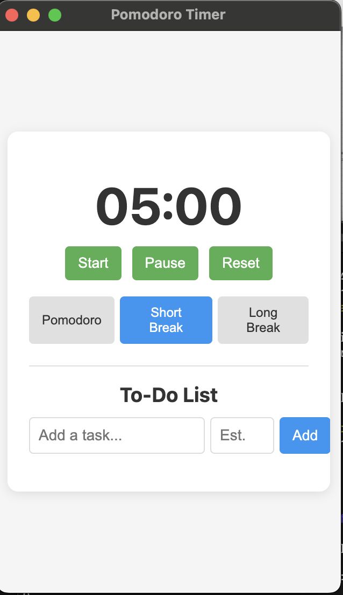

# Pomodoro Timer

A simple Pomodoro timer application built with Electron. It helps boost your productivity using the [Pomodoro Technique](https://en.wikipedia.org/wiki/Pomodoro_Technique) with a focus on minimalism and user experience.



## Features

- Always-on-top window for constant visibility
- Customizable timer durations:
  - Pomodoro timer (default: 25 minutes)
  - Short break timer (default: 5 minutes)
  - Long break timer (default: 15 minutes)
- To-do list with time estimation
- Click on tasks to set as current focus
- Task completion tracking
- Enhanced rest alerts with visual overlay
- Multiple sound notifications when timer ends
- Automatic mode switching after timer completion
- Desktop notifications
- Data persistence (to-do items saved locally)
- Optional auto-start on login (configurable in settings)

## Installation

### Download Release

Download the latest release from the [Releases](https://github.com/kimjuik/pomodoro/releases) page.

### Build From Source

```bash
# Clone this repository
git clone https://github.com/kimjuik/pomodoro.git

# Navigate to the repository directory
cd pomodoro

# Install dependencies
npm install

# Start the application
npm start
```

## Building the Application

To build a standalone application:

```bash
# Install dependencies
npm install

# Create a distributable package
npm run dist
```

This will create a `.dmg` file in the `dist` directory that you can use to install the application.

## Using the App

1. **Start a Pomodoro session** by clicking the Start button
2. **Add tasks** to your To-Do list with estimated completion times
3. **Click on a task** to set it as your current focus
4. **Mark tasks as complete** when you finish them
5. **Open Settings** from the File menu or system tray to customize timers and auto-start preferences

## Security Considerations

- The app saves data only locally on your machine
- No data is transmitted over the network
- The auto-start functionality uses macOS Launch Agents with your username in the bundle identifier
- You can view and manage Launch Agents in `~/Library/LaunchAgents/`